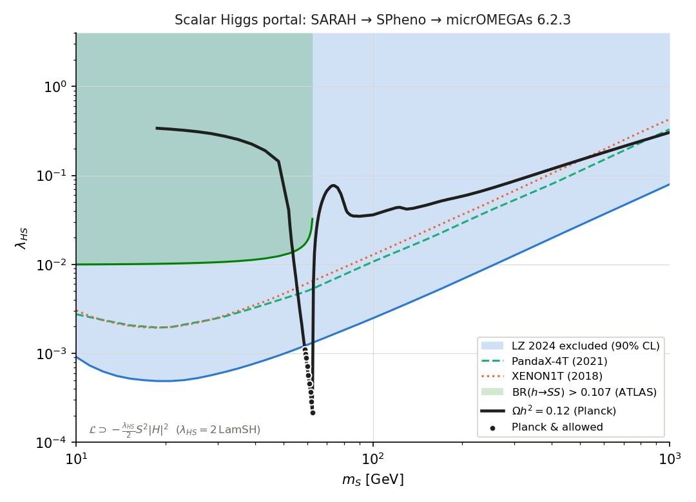
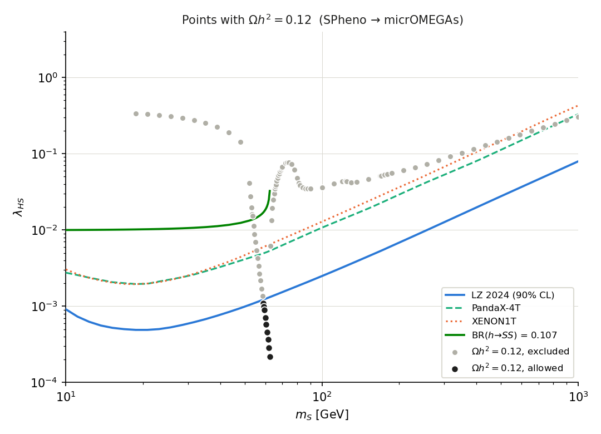
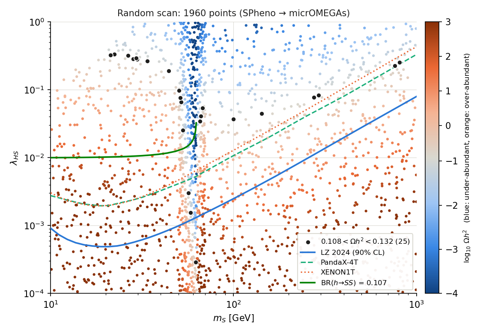
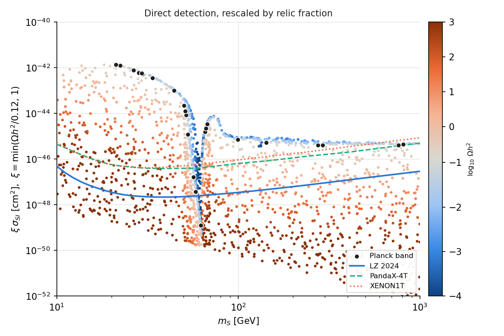

# Singlet-Scalar Higgs-Portal Dark Matter

This is an automated phenomenology pipeline for the real singlet-scalar dark matter
model with a Higgs portal:

**SARAH → SPheno → micrOMEGAs → parameter scans → plots**

It reproduces the scalar Higgs-portal panel of Fig. 4 of
[Arcadi et al., *The Waning of the WIMP?*, arXiv:1703.07364](https://arxiv.org/abs/1703.07364),
using current limits: LZ 2024, PandaX-4T, XENON1T, and ATLAS BR(h→inv).



## Model

$$
-\mathcal{L} \supset \frac{\mu_S^2}{2} S^2 + \frac{\lambda_{HS}}{2} S^2 |H|^2 + \frac{\lambda_S}{4!}S^4 \qquad (S \to -S \text{ under } Z_2)
$$

After electroweak symmetry breaking, $m_S^2 = \mu_S^2 + \lambda_{HS} v^2/2$. There are two free parameters, $(m_S, \lambda_{HS})$.

## Main result

With LZ 2024, the correct relic abundance ($\Omega h^2 = 0.12$) is compatible with all
constraints **only in the Higgs-resonance window $m_S \approx 59$–$62.5$ GeV**
($\lambda_{HS} \sim 2\times10^{-4}$–$10^{-3}$). Everything else from 10 GeV to 1 TeV is excluded.

| Scatter: Planck points | Random scan coloured by $\Omega h^2$ | Rescaled direct detection |
|---|---|---|
|  |  |  |

## Repository layout

```
├── run_all.sh              # Bash   – runs the whole pipeline end-to-end
├── hp_tools.py             # Python – one point: SPheno input -> SPheno -> micrOMEGAs -> parsed results
├── scan_planck.py          # Python – lambda_HS giving Omega h^2 = 0.12 for each mass (parallel)
├── scan_random.py          # Python – random scan of the (m_S, lambda_HS) plane
├── plot_fig4.py            # Python – Fig.4-style line plot + sigma_SI along the Planck line
├── plot_scatter.py         # Python – scatter plots
├── micromegas_main/main.c  # C      – micrOMEGAs driver (Omega, sigma_SI, <sigma v>, BR(h->SS), DD limits)
├── model/
│   ├── SARAH/              # SARAH model files: SSDM.m, parameters.m, particles.m, SPheno.m
│   │                       #   + generate_SSDM.m (Mathematica script that regenerates all output)
│   ├── SARAH_output/EWSB/  # full SARAH output used here: SPheno Fortran source, CHep, UFO,
│   │                       #   TeX, Vertices, One-/Two-Loop, FlavorKit
│   ├── CalcHEP/            # CalcHEP model generated by SARAH (used by micrOMEGAs)
│   └── SPheno/             # SPheno LesHouches input templates + QNUMBERS
├── results/                # CSV data + plots (PNG & PDF)
├── logs/                   # logs of the last full run (build, benchmark, scans)
└── requirements.txt
```

## Requirements

| Tool | Version used |
|---|---|
| Mathematica + [SARAH](https://sarah.hepforge.org) | 4.15.4 |
| [SPheno](https://spheno.hepforge.org) | 4.0.5 |
| [micrOMEGAs](https://lapth.cnrs.fr/micromegas/) | 6.2.3 |
| Python 3 | numpy, pandas, matplotlib (`pip install -r requirements.txt`) |
| gfortran, gcc, make | |

## Setup from scratch

The scripts expect the tools in one directory, set by the `HEPTOOLS` environment variable:

```
$HEPTOOLS/SARAH-4.15.4/
$HEPTOOLS/SPheno/
$HEPTOOLS/micromegas_6.2.3/
```

1. **SARAH**: copy `model/SARAH/*` to `$HEPTOOLS/SARAH-4.15.4/Models/SSDM/`, then in Mathematica run:
   ```mathematica
   <<"$HEPTOOLS/SARAH-4.15.4/SARAH.m";
   Start["SSDM"];
   MakeSPheno[];
   MakeCHep[];
   ```
   or just `math -script model/SARAH/generate_SSDM.m`. The output from this step is
   already included in `model/SARAH_output/`, so you can skip SARAH entirely and copy
   `model/SARAH_output/EWSB/SPheno/` in step 2.
2. **SPheno**: copy `SARAH-4.15.4/Output/SSDM/EWSB/SPheno/` to `$HEPTOOLS/SPheno/SSDM/` and build it:
   ```bash
   cd $HEPTOOLS/SPheno && make Model=SSDM
   ```
   This produces `$HEPTOOLS/SPheno/SSDM/SPhenoSSDM`, the path the scripts use. Adjust
   `SPHENO_EXE` in `hp_tools.py` if your build puts the binary somewhere else.
3. **micrOMEGAs**: `run_all.sh` creates and compiles the project `micromegas_6.2.3/SSDM_HP`
   automatically. It uses SARAH's CalcHEP output if present, otherwise `model/CalcHEP/`.

## Run

```bash
export HEPTOOLS=/path/to/HEPTools
./run_all.sh              # all cores, 2000 random points  (~35 min on 4 cores)
./run_all.sh 4 5000       # 4 workers, 5000 random points
```

Single point:

```bash
python3 hp_tools.py 62.0 3e-4        # m_S [GeV]  lambda_HS
```

Individual steps:

```bash
python3 scan_planck.py 4             # -> results/planck_curve.csv
python3 scan_random.py 2000 4 1      # -> results/random_scan.csv   (N, workers, seed; appends)
python3 plot_fig4.py
python3 plot_scatter.py
```

## Conventions and pitfalls

- **Coupling normalisation:** SARAH writes $-\mathcal{L} \supset \text{LamSH}\, S^2|H|^2$, so
  $\lambda_{HS}^{\text{paper}} = 2\,\text{LamSH}$. This was checked analytically against
  $\Gamma(h\to SS) = \lambda_{HS}^2 v^2 / (32\pi m_h)\sqrt{1-4m_S^2/m_h^2}$.
- **SPheno `MINPAR 4` (`MSinput`) is $\mu_S^2$ in GeV², not the mass.** `hp_tools.py` sets
  `MSinput` $= m_S^2 - \text{LamSH}\,v^2$, so you can scan the physical mass directly.
- **micrOMEGAs must read `MSs` from the SLHA spectrum**, `slhaVal("MASS",Q,1,6666635)`.
  Don't hard-code it in `vars1.mdl`.
- **Direct-detection exclusions in the $(m_S,\lambda_{HS})$ plane assume $S$ is all of the DM**,
  as in the paper. `scatter_random_sigmaSI` rescales by $\xi = \min(\Omega h^2/0.12, 1)$ instead.
- **SPheno fails for $m_S \lesssim 17$ GeV with $\lambda_{HS} \gtrsim 0.2$** ($\mu_S^2$ is so fine-tuned
  that its decay routines see a tachyonic $S$). That region is excluded by $h\to$ invisible
  by orders of magnitude anyway.
- **Near $m_S \approx m_h/2$, micrOMEGAs' fast mode has about a few % numerical noise in $\Omega h^2$.**

## References

- G. Arcadi et al., *The Waning of the WIMP? A Review of Models, Searches, and Constraints*, [arXiv:1703.07364](https://arxiv.org/abs/1703.07364)
- F. Staub, *SARAH 4*, [arXiv:1309.7223](https://arxiv.org/abs/1309.7223)
- W. Porod, F. Staub, *SPheno 3.1*, [arXiv:1104.1573](https://arxiv.org/abs/1104.1573)
- G. Alguero et al., *micrOMEGAs 6.0*, [arXiv:2312.14894](https://arxiv.org/abs/2312.14894)
- LZ Collaboration, [arXiv:2410.17036](https://arxiv.org/abs/2410.17036)
- ATLAS Collaboration, BR(h→inv) combination, [arXiv:2301.10731](https://arxiv.org/abs/2301.10731)
